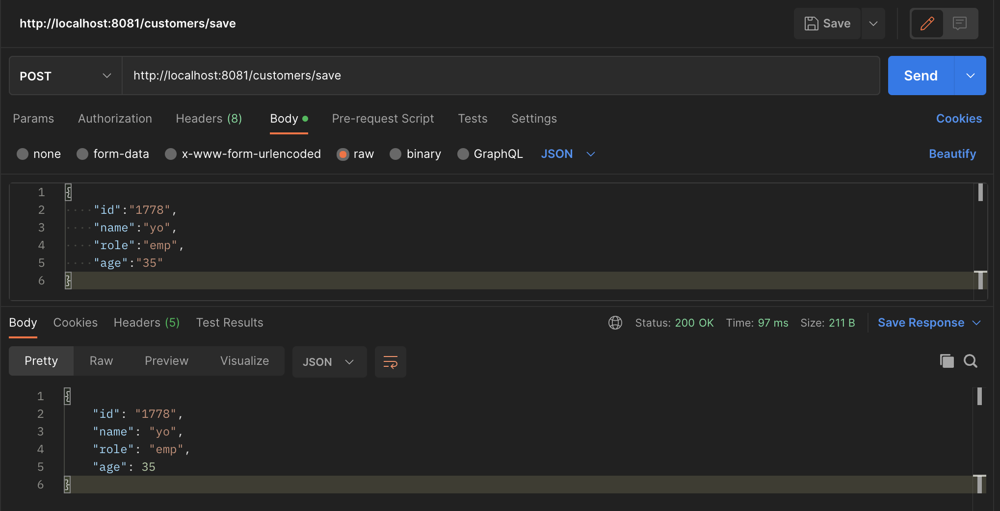
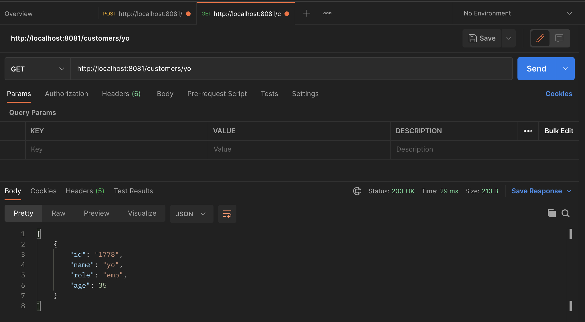

# sping-boot-monodb
Docker containerise Spring boot and Mongo db web api application

## Docker commands

    > mvn clean install
    > docker run 
    > docker build -t yogeshk04/spring-boot-mongodb:v1 .
    > docker push yogeshk04/spring-boot-mongodb:v1

## Run docker containers
    > docker pull mongo:6.0.3
    > docker run --name mongodb -d -p 28017:27017 mongo:6.0.3
    > docker inspect mongodb | grep IPAddress
        "SecondaryIPAddresses": null,
        "IPAddress": "172.17.0.2",
            "IPAddress": "172.17.0.2",
    
    > docker run --name api -e MONGODBHOSTNAME='172.17.0.2' -e MONGODBPORT='27017' -e MONGODBNAME='cust-demo' -p 8081:8081 yogeshk04/spring-boot-mongodb:v1

Post action in Postman 

GET action in Postman 
